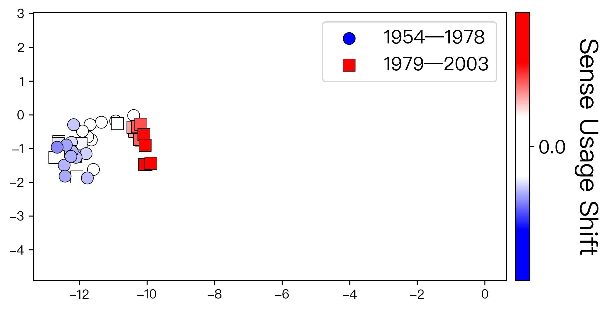
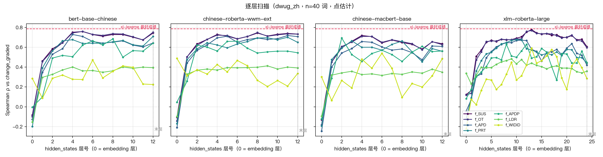

# 中文词汇语义演变检测

这是一个个人开展的小研究，旨在对比几种主流LSC方法在中文数据集上的实战效果。

本仓库 fork 自 [ryo-lyo/Semantic-Shift-via-UOT](https://github.com/ryo-lyo/Semantic-Shift-via-UOT)。我在原代码基础上做了一些中文适配，并在若干方面对比了UOT和其他主流方法在中文数据集上的表现。原作者的说明见 [README_upstream.md](README_upstream.md)。

---

## 研究问题

词语的意思会随时间变化。例如「下海」在 1950 年代多指到海里去，1980 年代以后多指辞职经商。词汇语义演变检测（Lexical Semantic Change Detection, LSC）研究如何让计算机自动发现并量化这类变化。

主流做法是用语言模型把一个词在两个时期的每条例句编码成向量，再比较两团向量的差异。比较方式大致有三类：

- 直接计算两团向量之间的距离，如 APD、PRT
- 先把例句聚类成义项，再比较义项分布，如 WiDiD、APDP
- 用最优传输（OT）衡量把一团向量「搬运」成另一团的代价。Kishino et al. 进一步用**不平衡**最优传输（UOT）提出了 SUS，可以为每一条例句单独打分，指出它所代表的用法在变多还是变少

UOT此前主要在英语上评测。本项目希望对比UOT与其他方法在中文上的表现。



*「下海」的例句向量降维到二维。蓝色圆点为 1954–1978 年，红色方块为 1979–2003 年，颜色深浅为该例句的 SUS 分数*

---

## 数据与实验设置

**数据集**：ChiWUG（Chen et al., LChange 2023）。语料为《人民日报》，分 1954–1978 与 1979–2003 两期。

**编码器（词->向量）**：

| 模型 | 参数量 | 说明 |
|---|---|---|
| `pierluigic/xl-lexeme` | 560M | XLM-R-large 在词义任务上微调 |
| `bert-base-chinese` | 102M | 按字切分 |
| `hfl/chinese-roberta-wwm-ext` | 102M | 全词掩码 |
| `hfl/chinese-macbert-base` | 102M | 改进的掩码策略 |
| `xlm-roberta-large` | 560M | XL-LEXEME 的未微调骨干 |

**度量方法**：SUS、OT、APD、PRT、APDP、LDR、WiDiD，共 7 种。

**评测**：以人工标注得到的变化分数为标准答案，计算 Spearman 秩相关

---

## 主要发现

### 1. 方法间的差距

以 XL-LEXEME 为例，各方法与标准答案的相关系数如下：

| 方法 | Spearman ρ | 95% 置信区间 |
|---|---|---|
| SUS | 0.786 | [0.571, 0.912] |
| OT | 0.779 | [0.563, 0.908] |
| APD | 0.734 | [0.503, 0.880] |
| PRT | 0.702 | [0.462, 0.860] |
| APDP | 0.657 | [0.402, 0.831] |
| LDR | 0.494 | [0.204, 0.702] |
| WiDiD | 0.441 | [0.148, 0.658] |

- **LDR 和 WiDiD 在全部 5 个编码器上都显著差于 SUS**，差值在 −0.24 到 −0.48 之间。Periti & Tahmasebi（NAACL 2024）在同一数据集上的独立结果也呈现同样的规律。
- **SUS 与平衡 OT 在全部 5 个编码器上无法分辨**，且置信区间很窄，最窄为 [−0.017, +0.025]。原论文在英文上的结果中，OT 同样不低于 SUS。

### 2. 编码器层数的选取



- 四个可选层的编码器表现出一致的规律：从第 0 层快速上升，在中间层达到最好，**到最后一层反而下降**。同一个 `xlm-roberta-large`，换一层相关系数可以从 0.12 变到 0.78。

嵌套交叉验证下的 SUS 结果：

| 编码器 | ρ |
|---|---|
| xl-lexeme | 0.752 |
| xlm-roberta-large | 0.716 |
| bert-base-chinese | 0.658 |
| chinese-macbert-base | 0.634 |
| chinese-roberta-wwm-ext | 0.615 |

---

## 工程工作

- **修复 ChiWUG 的行序错位**。原代码按行号对齐例句与义项标签，依照此方法检索会导致 ChiWUG 的两个文件 40 个词全部错位。
- **补丁式修改上游代码**。所有改动由 `scripts/patch_for_chiwug.py` 统一施加，可重复执行，也可还原。
- **采用通用编码脚本**。支持 HuggingFace 模型。

---

## 复现

### 环境

- Python 3.11
- `transformers` 低于 4.46，`huggingface_hub` 低于 1.0。XL-LEXEME 依赖旧版接口，新版会导致导入失败
- 其余主要依赖：`torch`、`sentence-transformers==3.1.0`、`POT`、`numpy<2`、`pandas`、`scikit-learn`、`matplotlib`

```bash
pip install "transformers==4.41.0" "huggingface_hub<1.0" "sentence-transformers==3.1.0" "numpy<2" torch POT pandas scikit-learn scipy matplotlib tqdm
```

### 依赖代码与数据

```bash
# APP 聚类所需的代码
git clone https://github.com/FrancescoPeriti/CSSDetection

# XL-LEXEME：原版 pip install 会失败。本脚本会自动克隆、修复后安装
bash scripts/install_xl_lexeme.sh
```

ChiWUG 数据集可从 [WUGsite](https://www.ims.uni-stuttgart.de/data/wugs) 下载。

### 运行

`src/` 中的补丁已经提交，无需再次运行补丁脚本。

```bash
export UOT_DATASET=dwug_zh

# 数据准备与对齐检查
python scripts/prepare_chiwug.py --chiwug /path/to/chiwug --out data/dwug_zh
python scripts/dryrun_check.py

# XL-LEXEME 基线向量
python src/calc_embeddings.py

# 编码器 × 方法对比（其余 4 个编码器会自动生成向量）
python scripts/run_encoder_comparison.py --auto-encode

# 逐层扫描（全部层的向量约 390 MB）
for m in bert-base-chinese hfl/chinese-roberta-wwm-ext hfl/chinese-macbert-base xlm-roberta-large; do
  python scripts/calc_embeddings_bert.py --model $m --layers all
done
python scripts/run_layer_sweep.py --nested-cv

# 补充实验与基线检验
python scripts/run_pool_ablation.py --auto-encode
python scripts/run_regm_ablation.py
python scripts/check_instance_baselines.py
```

结果输出到 `outputs/`。

---

## 局限与后续

- 数据只有 40 个词，统计功效有限，编码器之间的差异目前无法分辨。计划做功效分析，估计需要多少词才能分辨。
- 例句级上 SUS 与 LDR、WiDiD 之间的配对比较尚未完成。
- 等等

---

## 参考文献

1. Kishino, R., Yamagiwa, H., Nagata, R., Yokoi, S., & Shimodaira, H. (2025). *Quantifying Lexical Semantic Shift via Unbalanced Optimal Transport*. ACL 2025.
2. Chen, J., Chersoni, E., Schlechtweg, D., Prokić, J., & Huang, C.-R. (2023). *ChiWUG: A Graph-based Evaluation Dataset for Chinese Lexical Semantic Change Detection*. LChange 2023.
3. Periti, F., & Tahmasebi, N. (2024). NAACL 2024.
4. Cassotti, P., et al. (2023). *XL-LEXEME: WiC Pretrained Model for Cross-Lingual LEXical sEMantic changE*. ACL 2023.
